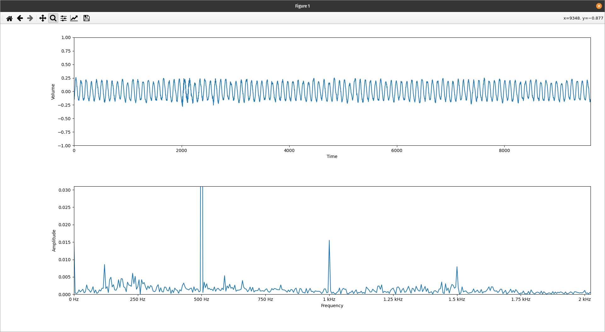
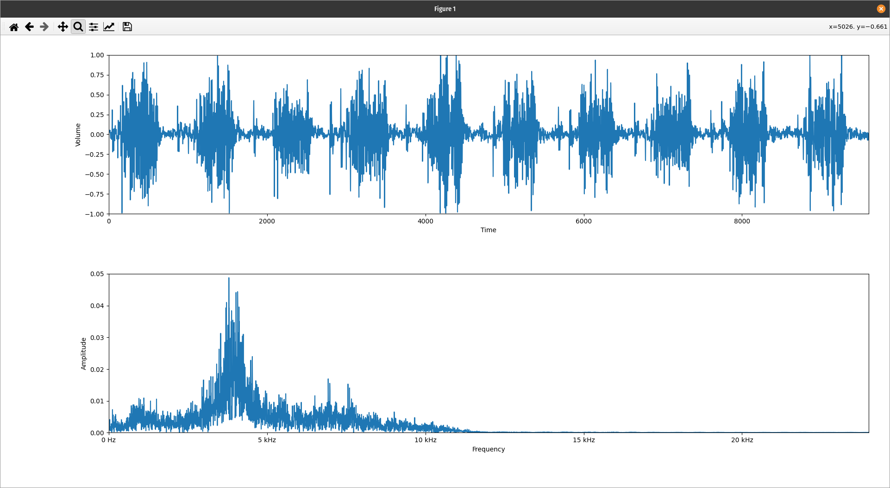

# AudioScope
Plot audio signals and frequencies in real time using python and matplotlib. This project is still early on, but this will be paired with a wide range of other utilities. A useful feature of this right now is the ability to adjuct the figure axes and scale as needed during the animation.  

## Sine Wave - 500Hz

## Noise - 500Hz

